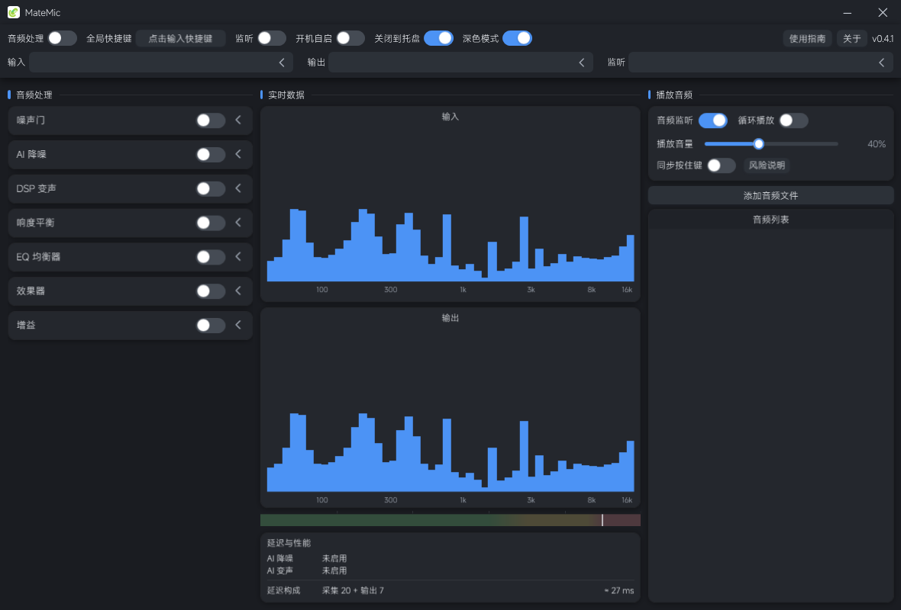

# MateMic

> 给游戏与语音通话用的 Windows 实时麦克风处理工具：降噪、响度平衡、均衡、变声与音效。

MateMic 常驻系统托盘，把物理麦克风的声音实时处理一遍再送到虚拟声卡，这样游戏、Discord、OBS 里选到的话筒就是你处理后的声音。全部处理在本机完成，**不联网、无账号、无遥测**。

## 功能

| 模块 | 说明 |
|---|---|
| 噪声门 | 底噪抑制 |
| AI 降噪 | 内置 3 个模型，也可放入自己的 `.onnx` |
| DSP 变声 | 变调 / 声线 / 共振峰 / 干湿比 |
| AI 变声 | **可选组件**（需另行下载，见下）；RVC 音色转换，可用自己的 ONNX 音色与索引 |
| 响度平衡 | 自动增益，稳定音量 |
| EQ 均衡器 | 10 段推子 + 实时响应曲线，5 套预设（清亮 / 沉稳 / 深邃 / 尖锐 / 空灵） |
| 效果器 | 混响 / 延迟 / 和声 / 电音 / 炸麦 / 电话 / 颤音 |
| 增益 | 手动 −24 ~ +24 dB |

每个模块可单独开关，点右侧箭头展开细调。

- **设备**：输入 / 输出 / 监听分开选择并各自记忆；麦克风热插拔自动重连
- **实时数据**：输入 / 输出双频谱 + 电平条（判断音量合不合适的参照尺）；底部「延迟与性能」卡片显示各模块负载、延迟构成与总体预估延迟。界面在最小化、收进托盘或检测到全屏应用（游戏）运行时会自动停止刷新，不占性能
- **播放器**：伴奏 / 语音包列表，可给每条绑定全局播放快捷键；鼠标悬浮有高亮，正在播放的那一条**行背景直接当作播放进度条**；支持循环播放
- **同步按住键**：播放某个音频时自动按下、播放结束后松开你指定的按键（默认关闭，理由见「已知限制」）
- **使用指南**：界面右上角内置分页说明，覆盖全部模块与常见操作
- **其它**：全局快捷键一键开关（带冲突检测）、开机自启、关闭到托盘、深色 / 浅色主题；配置、降噪模型与录音都存在程序目录下，绿色便携

## AI 变声（可选组件）

AI 变声**不随主程序分发**（包含 CUDA 运行库，体积很大），需要单独下载后装进主程序：

1. 从 [Releases](https://github.com/Rxain555/MateMic/releases) 下载两个组件包：
   - `MateMic-AIComponent-<版本>-common.zip` —— 通用运行时 + 推理引擎
   - `MateMic-AIComponent-<版本>-cuda.zip` —— CUDA 运算组件（N 卡必需）
2. 把两个 zip 依次拖进 MateMic 主界面（或在「AI 变声」卡片里点「添加组件」），装完重启程序
3. 在「AI 变声」卡片里选音色与索引，打开开关即可

- 支持 **RVC V2** 的 ONNX 音色与 `.index` 索引（可用转换工具把 `.pth` 转成 ONNX）
- 音色模型与索引**由使用者自备**，版权与许可归其提供方；本程序不内置任何音色
- 需要 NVIDIA 显卡，以及 **≥ 4 GB 可用显存**；组件包内已含所需的 CUDA / cuDNN 运行库，无需自行安装 CUDA Toolkit
- 打开 AI 变声后占用的内存（模型 + CUDA context）在关闭该模块后**不会立即还给系统**，要彻底释放需退出程序
- 「额外缓冲」滑条决定推理输出在水位上的取舍：越小延迟越低，越小也越容易卡顿
- 没有 NVIDIA 显卡时 AI 变声不可用，其余模块不受影响

## 界面



## 安装

从 [Releases](https://github.com/Rxain555/MateMic/releases) 下载：

- **安装程序** `MateMic-<版本>-setup.exe`：双击按向导安装，默认装到 `%LocalAppData%\Programs\MateMic`，不需要管理员权限
- **绿色版** `MateMic-<版本>-portable.zip`：解压到任意目录，双击 `MateMic.exe`

需要 **Windows 10 1809 及以上**，以及 **.NET 9 桌面运行时**（缺失时程序无法启动，去 [dotnet.microsoft.com](https://dotnet.microsoft.com/download/dotnet/9.0) 装 Desktop Runtime 9.x x64）。

## 使用

MateMic **不自己创建虚拟声卡**，需要配合 MIXLINE（或 VB-Cable）使用：

1. 在 Windows 声音设置里把 **MIXLINE Stream** 设为默认输入设备
2. 在 MateMic 里选设备：输入选物理麦克风，输出选 `扬声器 (MIXLINE)`，监听选你的耳机
   （三个要选**不同**的设备；输出没选时会退回系统默认播放设备，也就是你的扬声器）
3. 在 MIXLINE 里添加输入 `MateMic`、输出 `MIXLINE Stream`，并把这两个节点连起来
4. 打开 MateMic 左上角的「音频处理」总开关，再按需开启各个模块

装完程序后点界面右上角的**「使用指南」**按钮，里面就是这几步。

## 从源码构建

```bat
dotnet build MateMic\MateMic.sln -c Debug -m:1
dotnet run --project MateMic\MateMic.csproj
```

打包绿色版或安装程序（安装程序需要 Inno Setup 6）：

```powershell
.\打包\make-package.ps1
.\打包\make-package.ps1 -WithSetup
```

## 已知限制

- 只支持 Windows
- 「同步按住键」使用 `SendInput` 注入按键，**理论上存在被反作弊判定的风险**，因此该功能默认关闭；开启前会弹出风险说明要求确认
- AI 变声需要 NVIDIA 显卡；其 CUDA 内存池在关闭该模块后不归还系统（见上）
- 窗口尺寸固定，不可拉伸

## 许可

[MIT](LICENSE)

## 致谢

- 界面字体：[MiSans](https://hyperos.mi.com/font)（小米，免费商用；仅作界面显示，未做任何改动）
- 虚拟声卡：[MIXLINE](https://www.logitech.com/) / [VB-Cable](https://vb-audio.com/Cable/)
- 降噪模型：[DPDFNet](https://github.com/ceva-ip/DPDFNet)、[GTCRN](https://github.com/Xiaobin-Rong/gtcrn)
- 音频库：[NAudio](https://github.com/naudio/NAudio)、[NWaves](https://github.com/ar1st0crat/NWaves)、[ONNX Runtime](https://onnxruntime.ai/)、[Signalsmith Stretch](https://github.com/Signalsmith-Audio/signalsmith-stretch)
- AI 变声：算法基于 [RVC / Retrieval-based-Voice-Conversion-WebUI](https://github.com/RVC-Project/Retrieval-based-Voice-Conversion-WebUI)（MIT）；向量检索 [faiss](https://github.com/facebookresearch/faiss)，线性代数 [OpenBLAS](https://www.openblas.net/)；GPU 推理依赖 NVIDIA [CUDA](https://developer.nvidia.com/cuda-toolkit) 与 [cuDNN](https://developer.nvidia.com/cudnn)
- 对标参考：[MeowMic](https://github.com/NanCheng-L/MeowMic)、[PureVox](https://github.com/a2heng/PureVox)
