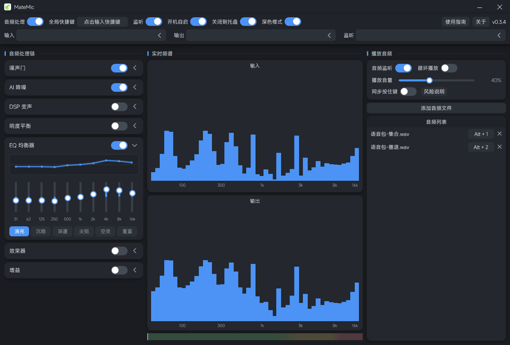

# MateMic

> 给游戏与语音通话用的 Windows 实时麦克风处理工具：降噪、响度平衡、音色与音效。

MateMic 常驻系统托盘，把物理麦克风的声音实时处理一遍再送到虚拟声卡，这样游戏、Discord、OBS 里选到的话筒就是你处理后的声音。全部处理在本机完成，**不联网、无账号、无遥测**。

## 功能

| 模块 | 说明 |
|---|---|
| 噪声门 | 底噪抑制 |
| AI 降噪 | 内置 3 个模型，也可放入自己的 `.onnx` |
| 响度平衡 | 自动增益，稳定音量 |
| 音色风格 | 清亮 / 沉稳 / 深邃 / 尖锐 / 空灵 / 自然 |
| 效果器 | 混响 / 延迟 / 合唱 / 电音 / 炸麦 |
| 增益 | 手动 −24 ~ +24 dB |

每个模块可单独开关。

- **设备**：输入 / 输出 / 监听分开选择并各自记忆；麦克风热插拔自动重连；双频谱加电平条实时显示信号
- **播放器**：伴奏 / 语音包列表，可给每条绑定全局播放快捷键
- **其它**：全局快捷键一键开关（带冲突检测）、开机自启、关闭到托盘；配置与录音都存在程序目录下，绿色便携

## 界面



## 安装

从 [Releases](https://github.com/Rxain555/MateMic/releases) 下载：

- **安装程序** `MateMic-<版本>-setup.exe`：双击按向导安装，默认装到 `%LocalAppData%\Programs\MateMic`，不需要管理员权限
- **绿色版** `MateMic-<版本>-portable.zip`：解压到任意目录，双击 `MateMic.exe`

需要 **Windows 10 1809 及以上**，以及 **.NET 9 桌面运行时**（缺失时程序无法启动，去 [dotnet.microsoft.com](https://dotnet.microsoft.com/download/dotnet/9.0) 装 Desktop Runtime 9.x x64）。

## 使用

MateMic **不自己创建虚拟声卡**，需要配合 MIXLINE（或 VB-Cable）使用：

1. 在 Windows 声音设置里把 **MIXLINE Stream** 设为默认输入设备
2. 在 MateMic 里选设备：输入选物理麦克风，输出选 `扬声器 (MIXLINE)`，监听选你的耳机
3. 在 MIXLINE 里添加输入 `MateMic`、输出 `MIXLINE Stream`，并把这两个节点连起来
4. 打开 MateMic 左上角的「音频处理」总开关，再按需开启各个模块

装完程序后点界面右上角的**「使用指南」**按钮，里面就是这几步。

## 从源码构建

```bat
dotnet build MateMic\MateMic.sln -c Debug -m:1
dotnet run --project MateMic\MateMic.csproj
```

打包绿色版或安装程序（安装程序需要 Inno Setup 6）：

```powershell
.\打包\make-package.ps1
.\打包\make-package.ps1 -WithSetup
```

## 已知限制

- 只支持 Windows
- 「同步按住键」使用 `SendInput` 注入按键，**理论上存在被反作弊判定的风险**，因此该功能默认关闭
- 窗口尺寸固定，不可拉伸

## 许可

[MIT](LICENSE)

## 致谢

- 虚拟声卡：[MIXLINE](https://www.logitech.com/) / [VB-Cable](https://vb-audio.com/Cable/)
- 降噪模型：[DPDFNet](https://github.com/ceva-ip/DPDFNet)、[GTCRN](https://github.com/Xiaobin-Rong/gtcrn)
- 音频库：[NAudio](https://github.com/naudio/NAudio)、[NWaves](https://github.com/ar1st0crat/NWaves)、[ONNX Runtime](https://onnxruntime.ai/)
- 对标参考：[MeowMic](https://github.com/NanCheng-L/MeowMic)、[PureVox](https://github.com/a2heng/PureVox)
